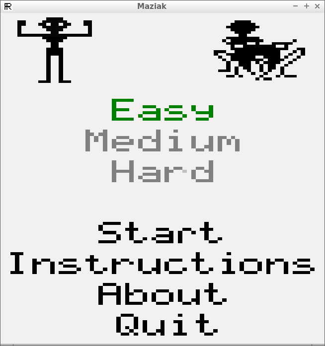
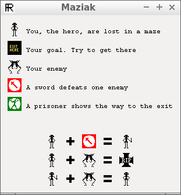

# Maziak

Branch|||
---|---|---|---
master|||
develop|||
coverity_scan|||

C++ maze game that is a port of the MSX game Maziak/Maziacs/Mazoggs

 * [Video of Maziak at 2017-04-02 (zipped)](Screenshots/20170402.zip)
 
 ## External links

 * [Richel Bilderbeek's games](https://github.com/richelbilderbeek/Games)
